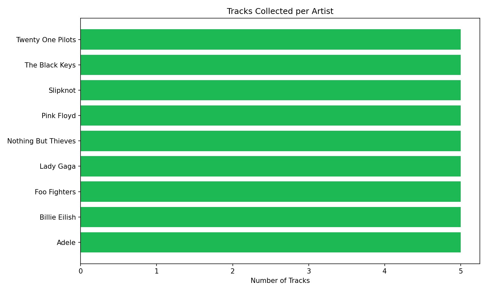
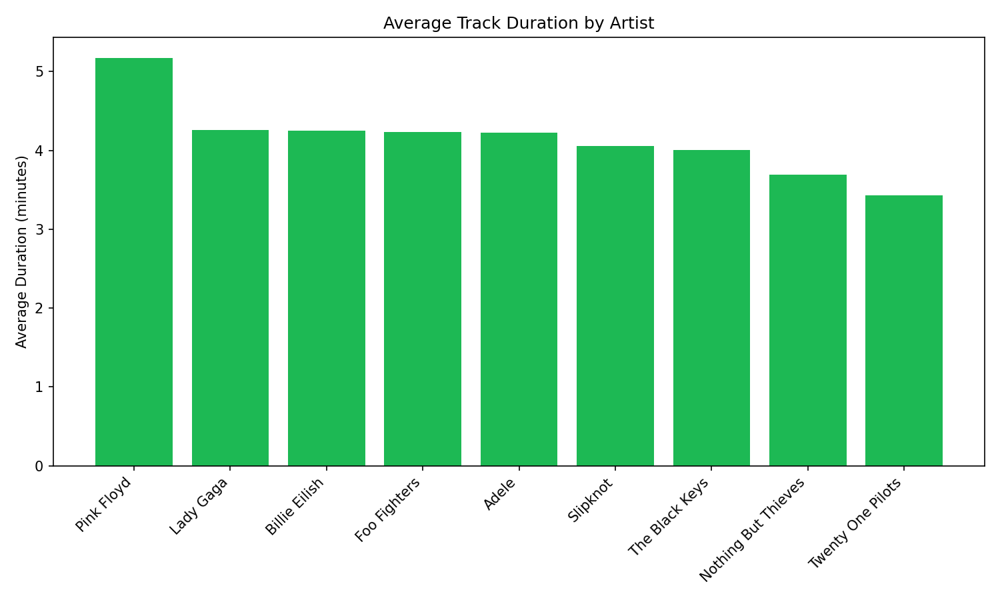
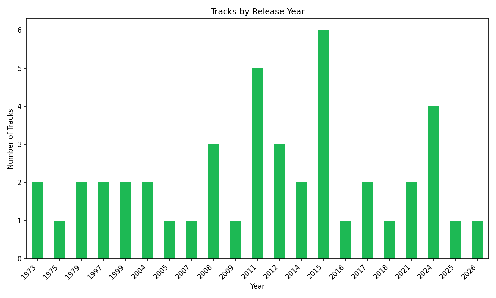
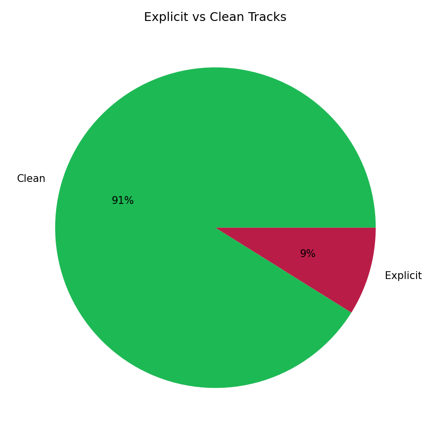

# Spotify Music Pipeline

A Python data pipeline that extracts music data from the Spotify Web API, transforms it into a clean dataset, and generates analysis with visualizations.

## What it does

1. **Extract** — Fetches tracks for a configurable list of artists via the Spotify Search API.
2. **Transform** — Cleans the raw data: parses dates, removes duplicates, converts units, and saves as CSV and Parquet.
3. **Analyze** — Generates summary statistics and charts from the collected data.

## Sample results

### Tracks Collected per Artist


### Average Track Duration by Artist


### Tracks by Release Year


### Explicit vs Clean Tracks


## Project structure
spotify-music-pipeline/
├── main.py                  # Runs the full pipeline
├── src/
│   ├── spotify_client.py    # Spotify API authentication and requests
│   ├── extract.py           # Step 1: data extraction
│   ├── transform.py         # Step 2: data cleaning and transformation
│   └── analyze.py           # Step 3: analysis and visualizations
├── tests/                   # Unit tests
├── data/
│   ├── raw/                 # Raw JSON from API (git-ignored)
│   └── processed/           # Clean CSV/Parquet + charts
├── requirements.txt
├── .env.example             # Template for API credentials
└── .gitignore
## Setup

### 1. Clone the repository

```bash
git clone https://github.com/anaalkmim/spotify-music-pipeline.git
cd spotify-music-pipeline
```

### 2. Create a virtual environment

```bash
python -m venv .venv
source .venv/bin/activate   # On Windows: .venv\Scripts\activate
```

### 3. Install dependencies

```bash
pip install -r requirements.txt
```

### 4. Configure Spotify credentials

Create a Spotify Developer account at [developer.spotify.com/dashboard](https://developer.spotify.com/dashboard) and create an app to get your Client ID and Client Secret.

```bash
cp .env.example .env
# Edit .env with your credentials
```

### 5. Run the pipeline

```bash
python main.py
```

### 6. Run tests

```bash
python -m pytest tests/ -v
```

## Customization

Edit the `ARTISTS` list in `src/extract.py` to collect data for any artists you want.

## Tech stack

- **Python 3.10+**
- **requests** — HTTP client for Spotify API
- **pandas** — Data manipulation and cleaning
- **matplotlib** — Data visualization
- **python-dotenv** — Environment variable management
- **pytest** — Testing

## License

MIT
